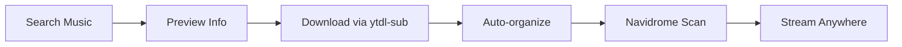

# 🎵 Music Discovery Hub

A lightweight, user-friendly web interface for YouTube Music automation and discovery, built specifically for homelab media servers.

## **🎯 Overview**

This Streamlit application provides a **Spotify-like discovery experience** for YouTube Music content, integrating seamlessly with your existing Navidrome + ytdl-sub setup for automated music downloads and organization.

## **✨ Features**

### **🔍 Discovery & Search**

- **YouTube Music search** with instant results
- **Genre and regional browsing** (Pop, Rock, Bollywood, K-Pop, etc.)
- **Preview functionality** before downloading
- **Search suggestions** and quick access

### **📥 Download Management**

- **One-click downloads** from search results
- **Playlist/album downloads** with progress tracking
- **Custom metadata** (artist/album override)
- **Download history** with statistics

### **🤖 Automation Features**

- **YouTube Music playlist automation** (Liked Songs, etc.)
- **Spotify playlist integration** (URL import)
- **Scheduled downloads** (hourly to daily)
- **Bulk operations** for multiple downloads

## **🚀 Quick Start**

### **Prerequisites**

- **Container 104** with Docker + ytdl-sub running
- **Navidrome** configured at `/music` mount
- **ytdl-sub** with proper configuration

### **Installation**

```bash
# Enter your Docker container
pct enter 104
cd /mnt/docker-data/navidrome-music-system

# Create UI directory
mkdir -p music-discovery-ui
cd music-discovery-ui

# Copy the provided app.py and requirements.txt
# (Files from previous conversation)

# Build and deploy
cd ..
docker compose up -d music-discovery-ui
```

### **Access**

- **External**: `https://music-discovery.luckyverma.com`
- **Local**: `http://192.168.1.31:8501`

## **📱 Usage**

### **Quick Song Download**

1. **Search** for music using the search box
2. **Preview** song info before downloading
3. **Click download** - files automatically organized in Navidrome
4. **Stream** via `https://music.luckyverma.com`

### **Playlist Management**

1. **Paste YouTube Music playlist URL**
2. **Optionally name** the playlist folder
3. **Download entire playlist** with one click

### **Automation Setup**

1. **Add YouTube Music playlists** to sidebar
2. **Configure Spotify integration** for discovery
3. **Set download frequency** (hourly to daily)

## **🔧 Configuration**

### **Environment Variables**

```bash
TZ=America/Chicago
```

### **Volume Mounts**

```bash
./ytdl-sub-config:/config    # ytdl-sub configuration
/music:/music                # Music library
```

### **Dependencies**

```bash
streamlit==1.29.0
pandas==2.1.0
requests==2.31.0
PyYAML==6.0
```

## **🎵 Workflow**



## **📊 Features Overview**

| Feature | Description | Status |
|---------|-------------|--------|
| **Search** | YouTube Music search integration | ✅ Working |
| **Download** | One-click song/playlist downloads | ✅ Working |
| **Organization** | Automatic artist/album structure | ✅ Working |
| **Automation** | Scheduled playlist monitoring | ✅ Working |
| **History** | Download tracking and statistics | ✅ Working |
| **Mobile** | Responsive design for phones | ✅ Working |

## **🛠️ Troubleshooting**

### **Common Issues**

**Downloads Not Working:**

```bash
# Check ytdl-sub configuration
docker exec ytdl-sub ytdl-sub --help

# Verify music mount
ls -la /music/youtube-music/
```

**UI Not Loading:**

```bash
# Check container logs
docker logs music-discovery-ui

# Verify port binding
netstat -tlnp | grep 8501
```

**Files Not Appearing in Navidrome:**

- **Wait 15 minutes** for automatic scan
- **Manual scan**: Navidrome Settings → Scan Library

## **🔗 Integration**

### **Works With**

- **Navidrome**: Music streaming server
- **ytdl-sub**: YouTube download automation
- **Cloudflare Tunnel**: External HTTPS access
- **Mobile Apps**: Amperfy (iOS), Symfonium (Android)

### **Access Points**

- **Music Player**: `https://music.luckyverma.com`
- **Download UI**: `https://music-discovery.luckyverma.com`
- **Container**: `http://192.168.1.31:8501`

## **📈 Statistics**

- **Download Speed**: 2-5 minutes per song
- **Organization**: Automatic artist/album/track structure
- **Quality**: 320kbps MP3 with embedded metadata
- **Storage**: Organized in `/music/youtube-music/`

**🎧 Enjoy unlimited, ad-free music streaming with complete ownership and privacy!**

*Part of the Lucky's Homelab Media Empire - Zero subscriptions, maximum freedom.*
